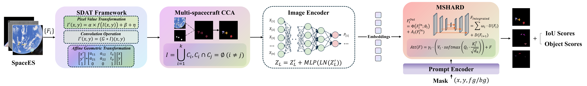

<div align="center">

<h1>SpaceSeg</h1>

<p><strong>A SAM2-based reproduction repository for high-precision multi-spacecraft on-orbit target segmentation.</strong></p>

<p>
  <a href="https://arxiv.org/abs/2503.11133"></a>
  <a href="LICENSE"></a>
  <a href="DATASET.md"></a>
  <a href="MODEL_CARD.md"></a>
  <a href="weights/README.md"></a>
</p>

<p>
  <a href="#overview">Overview</a> |
  <a href="#framework">Framework</a> |
  <a href="#quick-start">Quick Start</a> |
  <a href="#results">Results</a> |
  <a href="#dataset-and-weights">Dataset & Weights</a> |
  <a href="#license">License</a>
</p>

</div>

---

## Release Notice

This repository is a **desensitized and refactored public release** of the
original SpaceSeg experimental codebase. During publication, internal paths,
private datasets, experiment logs, non-public checkpoints, and sensitive
laboratory assets were removed or replaced with clean reproduction interfaces.

Due to laboratory safety and data governance policies, this public repository
only includes the reproducible SpaceSeg code, a curated SpaceES sample subset,
and public-safe weight release notes or release assets. The full SpaceES
dataset and internal training checkpoints are not distributed directly in this
git repository.

## Overview

SpaceSeg reproduces **"SpaceSeg: A High-Precision Intelligent Perception
Segmentation Method for Multi-Spacecraft On-Orbit Targets"**. The method adapts
SAM2 to multi-spacecraft segmentation on the SpaceES dataset and organizes the
training and evaluation pipeline around the paper's main components: MSHARD,
SDAT, CCA target organization, and a task-oriented mask quality loss.

The repository keeps the SAM2 runtime required by the model, provides clean CLI
entry points for training, evaluation, and inference, and includes a small
balanced sample dataset for smoke tests and demos.

## Framework

<p align="center">
  <a href="assets/pipe.pdf">
    
  </a>
</p>

The public pipeline follows the paper workflow: SpaceES samples are augmented by
SDAT, spacecraft instances are organized through connected components, SAM2
encodes the scene and prompts, and MSHARD refines mask decoding before IoU and
object scores are produced. Click the figure to open the source PDF.

## Highlights

| Component | Purpose | Public implementation |
|---|---|---|
| **SAM2 backbone** | Promptable segmentation foundation model | `sam2/`, `sam2_configs/` |
| **MSHARD** | Multi-scale high-accuracy refinement decoder | `sam2/modeling/sam/mask_decoder.py` |
| **SDAT** | Space-domain data augmentation for training | `spaceseg/sdat.py` |
| **CCA prompts** | Connected-component target organization and prompt sampling | `spaceseg/data.py` |
| **Task-oriented loss** | BCE mask loss plus IoU prediction supervision | `train_spaceseg.py` |
| **Clean CLIs** | Reproducible train/eval/infer entry points | `train_spaceseg.py`, `eval_spaceseg.py`, `infer_spaceseg.py` |

## Method Mapping

- **MSHARD** is implemented as the `sam_mask_decoder.unet` module to preserve
  compatibility with the final SpaceSeg checkpoint. It is wired into both the
  standard and high-resolution SAM2 mask decoder paths.
- **SDAT** is implemented in `spaceseg/sdat.py` and enabled by default during
  training.
- **CCA target organization** is implemented in `spaceseg/data.py` through
  binary mask connected components and point sampling.
- **Task-oriented loss** is implemented in `train_spaceseg.py` as segmentation
  BCE plus IoU-prediction loss with `--lambda-iou 0.05`.

## Public Release Contents

| Included | Not included in git |
|---|---|
| Refactored SpaceSeg training, evaluation, and inference code | Full SpaceES dataset |
| SAM2 runtime code needed by SpaceSeg | Internal laboratory datasets and raw assets |
| 32 train + 8 test SpaceES sample image/mask pairs | Internal experiment logs and W&B runs |
| Documentation, model card, dataset notes, and public framework figure | `.pth` / `.pt` checkpoints |
| Weight release instructions | `main.pdf` and private manuscript assets |

## Quick Start

Install on a CUDA machine with Python 3.10+:

```bash
pip install -e ".[spaceseg]"
```

Download the SAM2 Hiera-S checkpoint into `checkpoints/`:

```text
checkpoints/sam2_hiera_small.pt
```

Run a one-iteration smoke test on the public sample split:

```bash
python train_spaceseg.py \
  --train-root examples/spacees_sample/train \
  --val-root examples/spacees_sample/test \
  --pretrained-checkpoint checkpoints/sam2_hiera_small.pt \
  --iterations 1 \
  --validate-every 1
```

## Training / Evaluation / Inference

Use the full SpaceES layout when running paper-scale experiments:

```text
data/
  training/
    image/
    mask/
  test/
    image/
    mask/
```

Train SpaceSeg:

```bash
python train_spaceseg.py \
  --train-root data/training \
  --val-root data/test \
  --pretrained-checkpoint checkpoints/sam2_hiera_small.pt \
  --output-dir outputs/spaceseg
```

Evaluate a fine-tuned checkpoint:

```bash
python eval_spaceseg.py \
  --data-root data/test \
  --pretrained-checkpoint checkpoints/sam2_hiera_small.pt \
  --finetuned-checkpoint Out/final_best_model_mIoU_8987_mAcc_9998.pth
```

Run inference on the public sample split:

```bash
python infer_spaceseg.py \
  --source examples/spacees_sample/test/image \
  --mask-dir examples/spacees_sample/test/mask \
  --output-dir outputs/infer
```

When no mask directory is available, provide one or more prompt points:

```bash
python infer_spaceseg.py --source path/to/image.png --mask-dir "" --point 512,512
```

## Results

| Setting | Checkpoint | mIoU | mAcc | Notes |
|---|---|---:|---:|---|
| Full SpaceES test set | Final SpaceSeg checkpoint | 89.87 | 99.98 | Paper-scale reproduction target |
| `examples/spacees_sample/test` | Any compatible checkpoint | - | - | Smoke test and demo only |

The public sample dataset is intended for validating the code path, file
format, prompt sampling, and inference outputs. It is not large enough to
represent the full SpaceES benchmark distribution or reproduce the paper
metrics.

## Repository Structure

```text
SpaceSeg/
|-- train_spaceseg.py              # SpaceES training entry point
|-- eval_spaceseg.py               # mIoU / mAcc / FPS evaluation entry point
|-- infer_spaceseg.py              # Single-image or directory inference
|-- spaceseg/                      # Shared data, SDAT, metrics, and pipeline helpers
|-- sam2/                          # SAM2 runtime with SpaceSeg decoder wiring
|-- sam2_configs/                  # SAM2 model configs
|-- checkpoints/download_ckpts.sh  # Official SAM2 checkpoint downloader
|-- assets/                        # Public framework figure for the README
|-- examples/spacees_sample/       # Public 40-pair SpaceES sample subset
|-- weights/README.md              # SpaceSeg weight release notes
|-- DATASET.md                     # Dataset policy and format
|-- MODEL_CARD.md                  # Model card for the final checkpoint
`-- LEGACY_SCRIPTS.md              # Notes on archived experimental scripts
```

## Dataset And Weights

The full SpaceES dataset is intentionally excluded from git. The public sample
under `examples/spacees_sample/` contains 32 training pairs and 8 test pairs,
with matching image and mask filenames.

The final SpaceSeg checkpoint used for the paper-scale target result should be
placed locally at:

```text
Out/final_best_model_mIoU_8987_mAcc_9998.pth
```

See `DATASET.md`, `MODEL_CARD.md`, and `weights/README.md` for the current
release policy. Public sample data and released weights are provided for
research and non-commercial use only.

## AI Banner Prompt

Use this prompt to generate an optional GitHub README banner. Save the result as
`assets/spaceseg_banner.png` before adding it to the top of this page.

```text
Create a cinematic academic GitHub README banner for a research project named
"SpaceSeg". Wide aspect ratio 3:1, 1920x640 or higher. The scene should show
high-precision on-orbit multi-spacecraft perception in deep space: several
realistic satellites and spacecraft captured by an orbital camera, with Earth
limb, Moon/Mars tones, and a starfield in the background. Overlay subtle
translucent segmentation masks, contour lines, prompt points, and neural
network feature-map layers to suggest SAM2-based vision foundation model
segmentation, MSHARD multi-scale refinement, connected-component target
organization, and spatial domain adaptation.

Style: polished scientific visualization, realistic spacecraft, clean aerospace
engineering aesthetic, elegant dark space background with restrained cyan, blue,
white, and amber accents. High contrast, sharp details, professional
conference-paper project page look. Leave visual breathing room near the
center/top for README text. No national flags, no weapons, no missiles, no
humans, no cluttered HUD, no fake logos, no unreadable text. If text is
included, only a crisp minimal "SpaceSeg" title; otherwise no text.
```

## Citation

```bibtex
@misc{liu2025spaceseg,
  title         = {SpaceSeg: A High-Precision Intelligent Perception Segmentation Method for Multi-Spacecraft On-Orbit Targets},
  author        = {Hao Liu and Pengyu Guo and Siyuan Yang and Zeqing Jiang and Qinglei Hu and Dongyu Li},
  year          = {2025},
  eprint        = {2503.11133},
  archivePrefix = {arXiv},
  primaryClass  = {cs.CV},
  doi           = {10.48550/arXiv.2503.11133},
  url           = {https://arxiv.org/abs/2503.11133}
}
```

## License

Code follows the Apache 2.0 license inherited from SAM2. The SpaceES sample data
and released SpaceSeg weights are provided for research and non-commercial use
only; see `DATASET.md` and `MODEL_CARD.md`.
